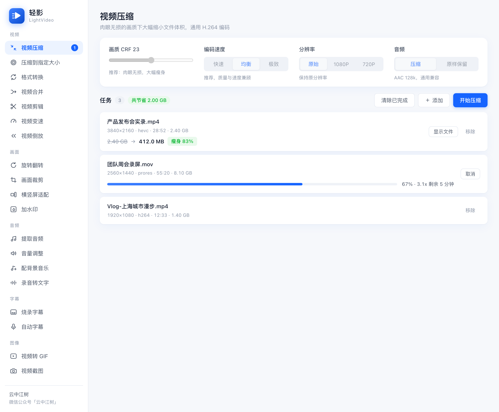
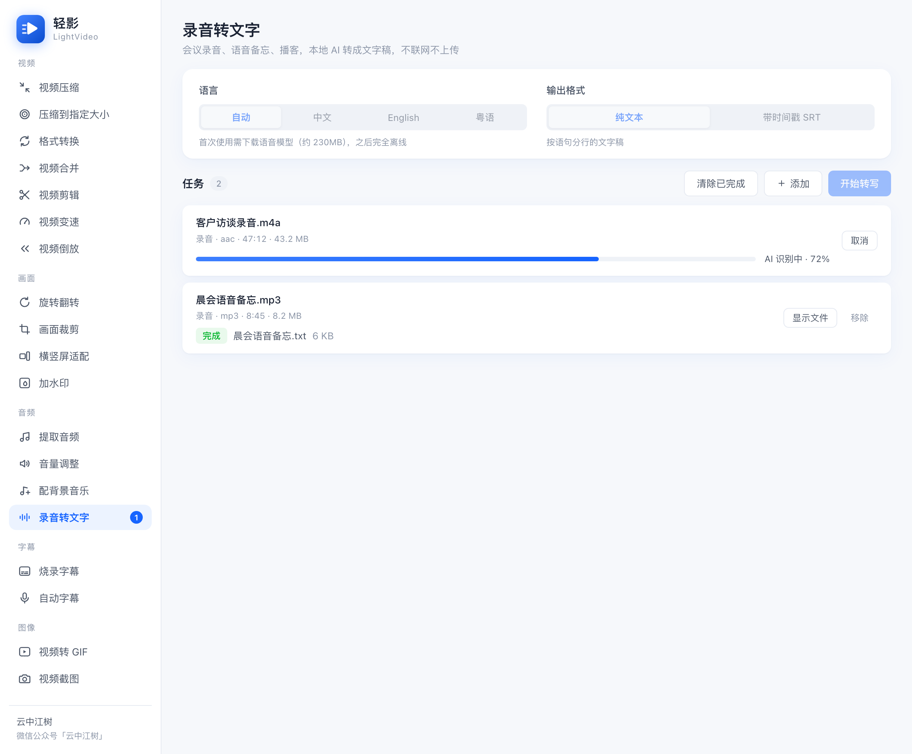
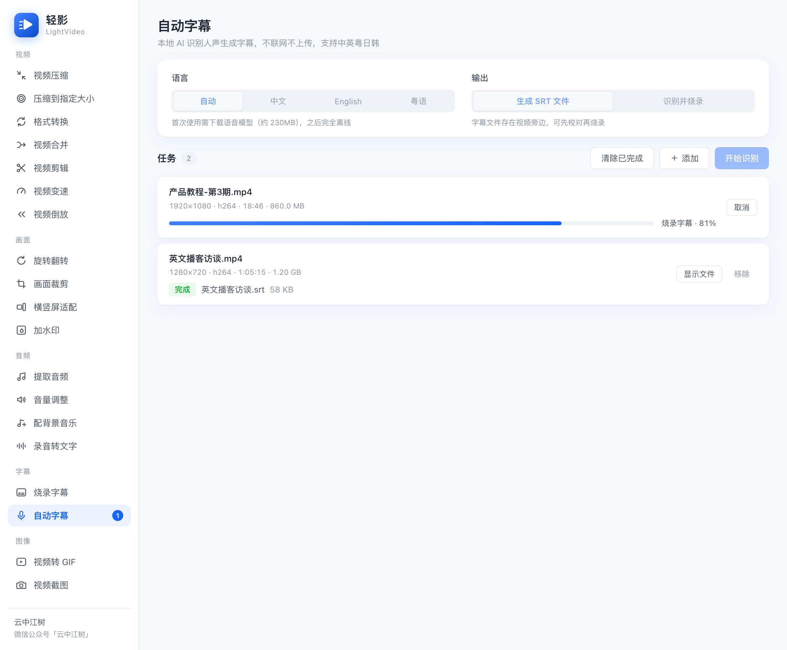

<div align="center">


**FFmpeg 视频工具箱 · 拖进来就能用**

压缩、转格式、合并、剪辑、变速、加水印、AI 自动字幕、录音转文字——
把最常用的视频处理做成一个干净的桌面应用，内置 FFmpeg 与本地语音识别，零依赖，下载即用。

[](../../releases)
[](https://v2.tauri.app/)
[](https://vuejs.org/)
[](LICENSE)
[](../../releases)

[下载安装](../../releases) · [功能一览](#十七个工具) · [从源码构建](#从源码构建) · [常见问题](#常见问题)

</div>

---

一切源于一条和 AI 一起发掘出来的指令：

```bash
ffmpeg -i input.mp4 -c:v libx264 -preset medium -crf 23 output.mp4
```

它能在肉眼无损的画质下把视频压小 50%~90%。但不是每个人都愿意打开终端。**轻影把这条指令、以及 FFmpeg 最常用的能力，做成了一个拖进来就能用的桌面应用。**

## 界面预览

**视频压缩**——批量队列、实时进度、压缩前后对比一目了然：



**录音转文字**——会议录音、语音备忘、播客，本地 AI 转成文字稿，不联网、不上传：



**AI 自动字幕**——识别人声生成字幕，可输出 SRT 或直接烧录进画面：



## 十七个工具

| 分组 | 工具 |
|------|------|
| **视频** | 视频压缩（CRF 肉眼无损）· 压缩到指定大小（两遍编码，应对微信等平台限制）· 格式转换（秒级换容器 / 重编码）· 视频合并（同参数无损拼接）· 视频剪辑（无损快剪 / 帧级精准）· 视频变速（0.5×–3×，音调自动修正）· 视频倒放 |
| **画面** | 旋转翻转 · 画面裁剪（比例居中裁剪）· 横竖屏适配（16:9 ⇄ 9:16，模糊背景铺满）· 加水印（位置 / 大小 / 透明度） |
| **音频** | 提取音频（MP3/M4A/WAV/FLAC）· 音量调整 / 移除音轨 · 配背景音乐（混音 / 循环 / 淡出）· **录音转文字**（本地 AI，输出文字稿或带时间戳 SRT） |
| **字幕** | 烧录字幕（SRT/ASS，中文字体自动适配）· **AI 自动字幕**（本地识别，中英粤日韩，生成 SRT 或直接烧录） |
| **图像** | 视频转 GIF（调色板两阶段算法）· 视频截图 |

通用能力：**批量队列**串行处理 · **实时进度**（百分比 / 速度 / 剩余时间）· **单帧效果预览**（水印 / 裁剪 / 字幕先看效果再开跑）· 输出**永不覆盖**原文件 · 失败一键重试。

**关于 AI 能力**：语音识别使用 [SenseVoice](https://github.com/FunAudioLLM/SenseVoice)（FunASR 系）模型 + [sherpa-onnx](https://github.com/k2-fsa/sherpa-onnx) 运行时，纯本地推理，识别速度约为实时的 30 倍。模型（约 230MB）首次使用时自动下载（支持断点续传与国内镜像），之后完全离线——你的录音和视频永远不会离开你的电脑。

## 下载使用

前往 [Releases](../../releases) 下载对应平台的安装包：

| 平台 | 安装包 |
|------|--------|
| macOS (Apple Silicon) | `LightVideo_x.x.x_aarch64.dmg` |
| macOS (Intel) | `LightVideo_x.x.x_x64.dmg` |
| Windows 10/11 | `LightVideo_x.x.x_x64-setup.exe` |
| Linux | `LightVideo_x.x.x_amd64.AppImage` / `.deb` |

macOS 版本已签名并通过 Apple 公证，打开无任何安全提示。

**三步上手**：选一个工具 → 拖入文件 → 点开始。就这样。

## 从源码构建

依赖：[Rust](https://rustup.rs/) stable、Node.js 18+

```bash
git clone https://github.com/yzfly/lightvideo.git && cd lightvideo

# 1. 安装依赖
npm install && npm install --prefix frontend

# 2. 下载静态 FFmpeg 与语音识别运行时 (打进应用的 sidecar 二进制)
./scripts/download_ffmpeg.sh
./scripts/download_asr_runtime.sh

# 3. 开发调试（热重载）
npm run dev

# 4. 构建安装包
npm run build
```

发布：推送 `v*` 标签即触发 GitHub Actions 自动构建四平台安装包。

## 技术架构

- **外壳**：[Tauri v2](https://v2.tauri.app/) —— 原生 WebView，安装包小、内存占用低
- **界面**：Vue 3 + Vite —— 亮色系设计，拖拽交互
- **编码内核**：FFmpeg 以 [sidecar](https://v2.tauri.app/develop/sidecar/) 形式内置静态构建
- **语音识别**：sherpa-onnx 静态 CLI + SenseVoice int8 模型 + Silero VAD，纯本地推理
- **工具注册表**：`frontend/src/tools.js` 声明式定义每个工具的参数、校验与 ffmpeg 命令构建——**新增一个工具只需登记一个对象**，欢迎 PR

```
frontend/            Vue 3 界面 + 任务调度 (src/backend.js) + 工具注册表 (src/tools.js)
src-tauri/           Tauri 外壳与少量 Rust 命令
src-tauri/binaries/  静态 FFmpeg / sherpa-onnx sidecar (由 scripts/ 下载, 不入库)
scripts/             sidecar 下载脚本、应用图标生成脚本
.github/workflows/   多平台自动发布流水线
docs/                README 素材与截图 demo 模式 (?demo=<toolId>)
```

## 常见问题

**为什么有的视频压不小？**
说明它已经用高效参数编码过了。CRF 编码保证"质量恒定"，不保证"一定变小"——遇到这种情况工具会如实告诉你。

**语音识别的数据会上传吗？**
不会。模型下载到本地后，识别全程离线运行，断网也能用。

**无损快剪的切点为什么有偏差？**
无损模式不重编码，切点只能落在关键帧上，可能偏差 1-2 秒；需要帧级精度时用「精准剪辑」。

**和剪映是什么关系？**
不是竞品。剪映赢在创作（时间轴、特效、转场），轻影赢在快——压缩、转格式、转文字这类"不值得打开剪映"的活儿，拖进来十秒出结果，还能批量。

**支持 H.265 / AV1 吗？**
当前以 H.264 为核心——兼容性最好，任何设备都能播。H.265 与硬件加速在路线图上。

## 许可

本项目代码采用 [CC BY-NC 4.0](https://creativecommons.org/licenses/by-nc/4.0/deed.zh)（署名-非商业性使用）。

内置 [FFmpeg](https://ffmpeg.org/)（GPL，静态构建来自 [martin-riedl.de](https://ffmpeg.martin-riedl.de/) 与 [BtbN/FFmpeg-Builds](https://github.com/BtbN/FFmpeg-Builds)）与 [sherpa-onnx](https://github.com/k2-fsa/sherpa-onnx)（Apache-2.0）。FFmpeg 是 FFmpeg 项目的商标。

## 作者

**云中江树** · 微信公众号「云中江树」

如果轻影帮你省了时间，点个 Star ⭐ 是最好的鼓励。
